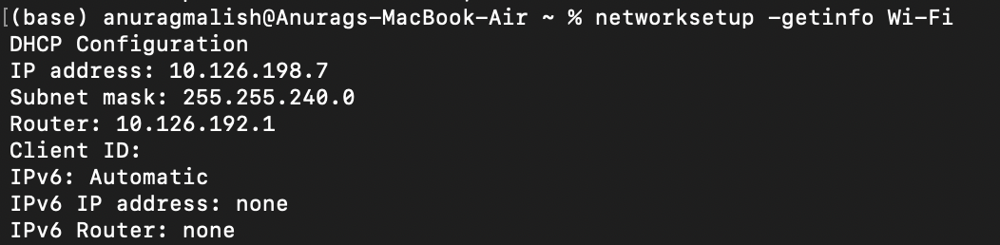
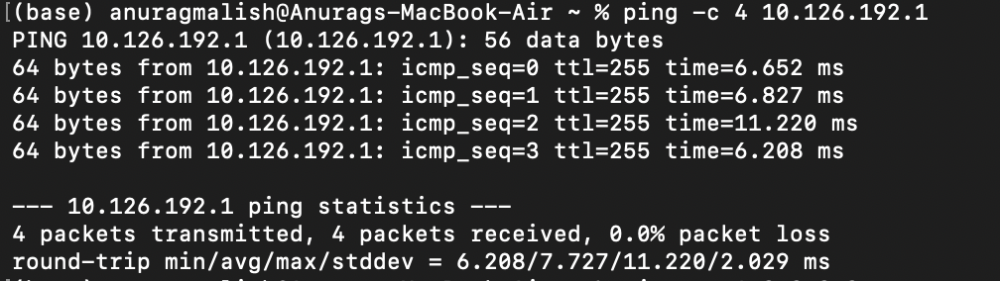
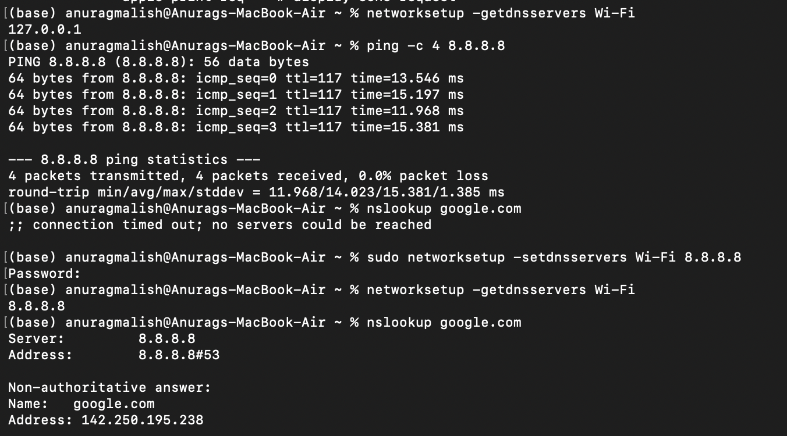

# Ticket #001 — Network Connectivity / DNS Resolution

## Ticket Information

**Category:** Network Connectivity  
**Priority:** Medium  
**Status:** Resolved  
**Environment:** macOS  
**Type:** Simulated Help Desk Lab

---

## User Report

> "My MacBook is connected to Wi-Fi, but I can't access any websites."

## Lab Scenario

A DNS misconfiguration was intentionally introduced by configuring the Wi-Fi interface to use `127.0.0.1` as its DNS server.

The objective was to troubleshoot the issue using a structured help desk methodology, identify the root cause, correct the configuration and verify that connectivity was restored.

---

## Troubleshooting Process

### 1. Checked Network Configuration

I reviewed the Wi-Fi network configuration using:

`networksetup -getinfo Wi-Fi`

The MacBook had received a valid IPv4 configuration through DHCP, including an IP address, subnet mask and default gateway.

This confirmed that the device was connected to the local network.

### 2. Tested Default Gateway Connectivity

I tested connectivity to the default gateway using:

`ping -c 4 10.126.192.1`

All four packets were successfully returned with **0% packet loss**.

This confirmed that the MacBook could communicate with the local network gateway.

### 3. Tested Internet Connectivity

I tested connectivity directly to a public IP address using:

`ping -c 4 8.8.8.8`

All four packets were successfully returned with **0% packet loss**.

This demonstrated that the device had internet connectivity despite being unable to access websites by domain name.

### 4. Tested DNS Resolution

I tested domain-name resolution using:

`nslookup google.com`

The request failed with:

`connection timed out; no servers could be reached`

Since direct IP connectivity worked while domain-name resolution failed, I investigated the DNS configuration.

### 5. Identified Root Cause

I checked the configured DNS server using:

`networksetup -getdnsservers Wi-Fi`

The Wi-Fi interface was configured to use:

`127.0.0.1`

For this lab environment, no DNS resolver was operating at this address.

This prevented the system from translating domain names such as `google.com` into IP addresses.

### 6. Applied Resolution

I corrected the DNS configuration using:

`sudo networksetup -setdnsservers Wi-Fi 8.8.8.8`

I then verified the new configuration using:

`networksetup -getdnsservers Wi-Fi`

The system returned:

`8.8.8.8`

### 7. Verified the Resolution

I repeated the DNS lookup:

`nslookup google.com`

The lookup successfully returned an IP address for `google.com`, confirming that DNS resolution had been restored.

---

## Root Cause

An incorrect DNS configuration prevented the system from resolving domain names despite having functional local network and internet connectivity.

## Resolution

Corrected the DNS server configuration and verified successful domain-name resolution.

## Skills Demonstrated

- Structured IT troubleshooting
- TCP/IP network diagnostics
- DHCP configuration review
- Default gateway connectivity testing
- DNS troubleshooting
- `ping` and `nslookup`
- macOS Terminal
- Fault isolation
- Technical documentation

---

## Evidence

### Network Configuration

Verified the device received a valid IP address, subnet mask and default gateway through DHCP.

### Default Gateway Connectivity

Confirmed communication with the local network gateway. Four packets were transmitted and received with 0% packet loss.

### DNS Diagnosis and Resolution

Confirmed that internet connectivity remained functional while DNS resolution failed. Identified the incorrect DNS server (`127.0.0.1`), changed it to `8.8.8.8`, and verified successful DNS resolution using `nslookup`.

