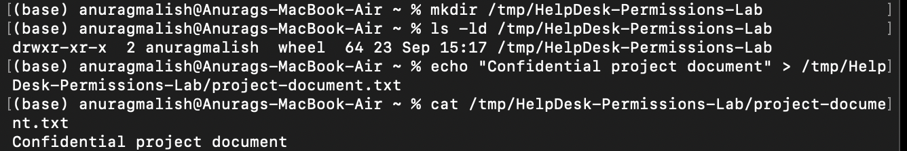
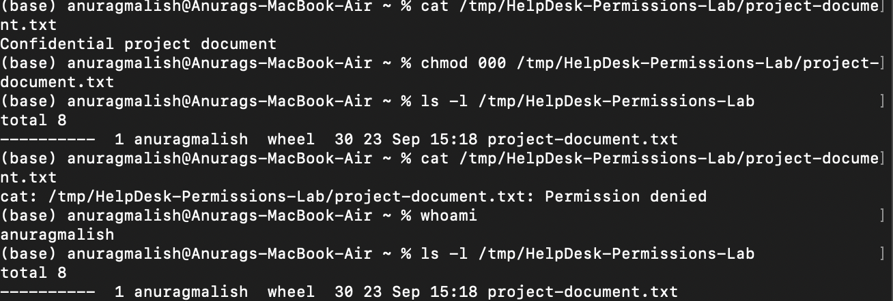
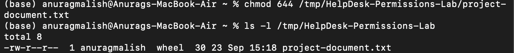
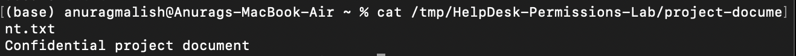

# Ticket #002 — File Permissions / Access Denied

## Ticket Information

- **Category:** File Permissions / Access Control
- **Priority:** Medium
- **Status:** Resolved
- **Environment:** macOS
- **Type:** Simulated Help Desk Lab

---

## User Report

The user reports that they are unable to access a required work document and receive a "Permission denied" error when attempting to open the file.

---

## Lab Scenario

A temporary test environment was created to simulate a file access issue caused by incorrectly configured permissions.

The document was initially accessible before its permissions were intentionally modified to reproduce the reported issue.

---

## Troubleshooting Process

### 1. Verified the File Was Initially Accessible

Created a test document and confirmed that the user could successfully read its contents.

```bash
cat /tmp/HelpDesk-Permissions-Lab/project-document.txt
```

The document displayed successfully:

```text
Confidential project document
```

### 2. Reproduced the Permission Issue

The file permissions were intentionally removed to reproduce the reported access issue.

```bash
chmod 000 /tmp/HelpDesk-Permissions-Lab/project-document.txt
```

The file permissions were inspected using:

```bash
ls -l /tmp/HelpDesk-Permissions-Lab
```

Attempting to read the file then returned:

```text
Permission denied
```

### 3. Investigated File Permissions

Verified the current user and inspected the file permissions using:

```bash
whoami
ls -l /tmp/HelpDesk-Permissions-Lab
```

The file showed:

```text
----------  1 anuragmalish  wheel  30  project-document.txt
```

The `----------` permission string indicated that no read, write or execute permissions were assigned to the file.

### 4. Restored Appropriate Permissions

Restored standard file permissions using:

```bash
chmod 644 /tmp/HelpDesk-Permissions-Lab/project-document.txt
```

The permissions were then verified with:

```bash
ls -l /tmp/HelpDesk-Permissions-Lab
```

The file now showed:

```text
-rw-r--r--
```

This grants the owner read/write access and group/others read-only access.

### 5. Verified Resolution

The file was opened again using:

```bash
cat /tmp/HelpDesk-Permissions-Lab/project-document.txt
```

The document contents displayed successfully, confirming that access had been restored.

---

## Root Cause

The file permissions had been incorrectly configured with permission mode `000`, removing read, write and execute access.

---

## Resolution

Changed the file permissions from `000` to `644`, restoring read/write access for the file owner and read access for group and other users.

---

## Evidence

### Initial File Access

Confirmed that the test document was accessible before reproducing the issue.



### Permission Denied and Diagnosis

Reproduced the access issue and confirmed that the file had no permissions assigned.



### Permissions Restored

Changed the file permissions to `644` and verified the new permission configuration.



### Access Verification

Confirmed that the document could be successfully accessed after correcting the permissions.



---

## Skills Demonstrated

- File permission troubleshooting
- Unix/macOS permission management
- `chmod` and `ls -l`
- User and ownership verification
- Root cause analysis
- Command-line troubleshooting
- Incident documentation
- Resolution verification
