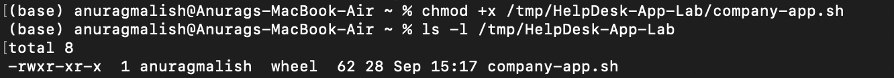
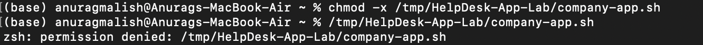
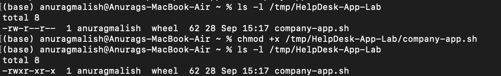
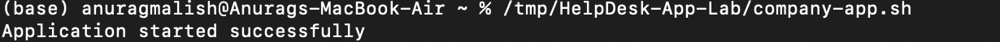

# Ticket #003 — Application Fails to Launch

## Ticket Information

- **Category:** Application Support / Troubleshooting
- **Priority:** Medium
- **Status:** Resolved
- **Environment:** macOS
- **Type:** Simulated Help Desk Lab

---

## User Report

The user reports that a required application will not launch. Attempting to start the application returns a "Permission denied" error.

---

## Lab Scenario

A temporary test environment was created to simulate an application launch issue on macOS.

A shell script was used to represent a company application. The application initially launched successfully before its execute permission was intentionally removed to reproduce the reported issue.

---

## Troubleshooting Process

### 1. Verified the Application Initially Launched

The application was first given execute permission:

```bash
chmod +x /tmp/HelpDesk-App-Lab/company-app.sh
```

The file permissions were verified using:

```bash
ls -l /tmp/HelpDesk-App-Lab
```

The application showed execute permissions:

```text
-rwxr-xr-x
```

The application was then launched:

```bash
/tmp/HelpDesk-App-Lab/company-app.sh
```

The application returned:

```text
Application started successfully
```

This confirmed that the application was functioning correctly before the issue was reproduced.

---

### 2. Reproduced the Application Launch Issue

Execute permission was intentionally removed:

```bash
chmod -x /tmp/HelpDesk-App-Lab/company-app.sh
```

The application was then launched again:

```bash
/tmp/HelpDesk-App-Lab/company-app.sh
```

The terminal returned:

```text
zsh: permission denied: /tmp/HelpDesk-App-Lab/company-app.sh
```

This successfully reproduced the reported application launch issue.

---

### 3. Investigated the Application Permissions

The application's permissions were inspected using:

```bash
ls -l /tmp/HelpDesk-App-Lab
```

The file showed:

```text
-rw-r--r--
```

The absence of `x` in the permission string indicated that the file did not have execute permission.

This explained why macOS could read the file but could not execute it as an application.

---

### 4. Restored Execute Permission

Execute permission was restored using:

```bash
chmod +x /tmp/HelpDesk-App-Lab/company-app.sh
```

The permissions were verified again:

```bash
ls -l /tmp/HelpDesk-App-Lab
```

The file now showed:

```text
-rwxr-xr-x
```

This confirmed that execute permission had been restored.

---

### 5. Verified the Resolution

The application was launched again:

```bash
/tmp/HelpDesk-App-Lab/company-app.sh
```

The terminal returned:

```text
Application started successfully
```

The application launched successfully after restoring execute permission, confirming that the issue had been resolved.

---

## Root Cause

The application did not have execute permission. Without execute permission, macOS prevented the script from being launched and returned a "Permission denied" error.

---

## Resolution

Restored execute permission to the application using:

```bash
chmod +x /tmp/HelpDesk-App-Lab/company-app.sh
```

Verified the updated permissions and successfully launched the application.

---

## Evidence

### Application Initially Working

Confirmed that the application had execute permissions and launched successfully before reproducing the issue.



### Application Launch Failure

Reproduced the reported issue by removing execute permissions. Attempting to launch the application returned a "Permission denied" error.



### Permission Diagnosis and Fix

Inspected the file permissions, identified that execute permission was missing, restored execute permission and verified the updated permissions.



### Resolution Verification

Launched the application after correcting the permissions and confirmed that it started successfully.



---

## Skills Demonstrated

- Application troubleshooting
- macOS command-line diagnostics
- Unix/macOS file permission analysis
- `chmod` and `ls -l`
- Troubleshooting permission-denied errors
- Root cause analysis
- Incident documentation
- Resolution verification
